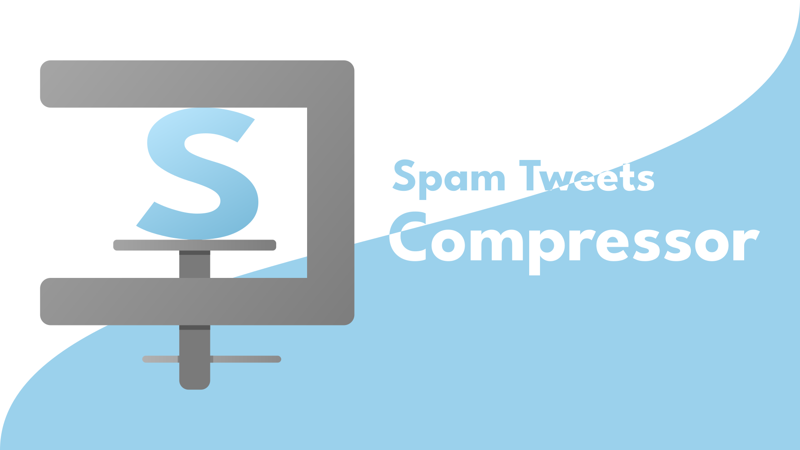

# Spam Tweets Compressor

[日本語](README_ja.md)

[](https://snyk.io/test/github/Robot-Inventor/spam-tweets-compressor/) [](https://github.com/Robot-Inventor/spam-tweets-compressor/actions/workflows/codeql-analysis.yml) [](https://github.com/Robot-Inventor/spam-tweets-compressor/actions/workflows/webpack.yml) [](https://github.com/Robot-Inventor/spam-tweets-compressor/actions/workflows/eslint.yml)



This extension protects you from tweets that you feel are harassing or threatening by "your standards".

## Summary

What kind of tweets you find harassing or threatening varies from person to person, and it can be difficult to make an objective judgment. This extension will hide tweets that you find "harassing or threatening" according to "your standards". This is an unofficial browser extension to protect your mind when viewing replies or ego-surfing.

### ✔ Can

- It can protect your mind by hiding tweets that may be harassing or threatening
- It allows you to set what kind of tweets are considered harassment or threats

### ✖ Can't

- There is no automatic reporting of tweets deemed potentially harassing or threatening, or the ability to mute or block the poster
- Hide only on your browser. Can't be hidden on other people's browsers
- Works only on [twitter.com](https://twitter.com) and [mobile.twitter.com](https://mobile.twitter.com). It can't work on other Twitter clients or mobile apps

### ⚠ Caution

- This is an unofficial extension, Twitter is not involved in any way
- Hides "possibly" harassing or threatening tweets. False positives and false negatives can also occur

## Supported Browsers

- Google Chrome
- Mozilla Firefox
- Chromium-based browsers (e.g. Microsoft Edge)

Note: The only browsers that have been tested are Google Chrome and Mozilla Firefox; Chromium-based browsers are likely to work correctly because they are internally identical to Google Chrome.

## Installation

You can install the extension from each browser's extension store.

- [Chrome Web Store (Google Chrome)](https://chrome.google.com/webstore/detail/spam-tweets-compressor/ahbajmjkdmknfdkcppkginogfjmpefjf)
- [AMO (Mozilla Firefox)](https://addons.mozilla.org/ja/firefox/addon/spam-tweets-compressor/)

## Judgment Method

This extension determines whether to hide a tweet based on the following factors.

- NG words
- Advanced Spam Detection

## About Personal Information

This extension analyzes tweets on the user's computer, so it does not send any information about the user to the outside world. However, it will communicate with the server to receive the latest filter data for " Advanced Spam Detection".

This extension will only use the permissions for the following purposes

- Use access to [twitter.com](https://twitter.com) to determine if the displayed tweets are spam and to hide tweets that are considered spam
- Use storage permission to save settings
- Use access to [cdn.statically.io](https://cdn.statically.io) to get the latest filter data

## Development

When developing, first install the necessary packages.

```
npm install
```

### Lint

To lint, run the following command.

```
npm run lint
```

### Build

To build, run the following command.

```
npm run build
```

Also, if you want to watch the changes in the file, run the following command.

```
npm run watch
```

### Package

To package the extension, run the following command.

```
npm run pack
```
