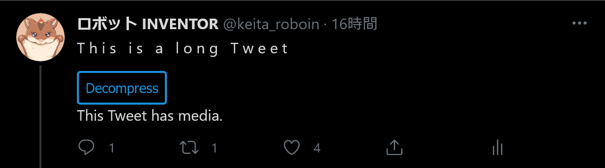

# Spam Tweets Compressor

[English](README.md)

スパムツイートを圧縮するブラウザー拡張機能です。現時点では「長い」ツイートを圧縮します。

## 長いツイートとは

「長い」ツイートとは、ツイートのテキストに大量の改行を挿入することでスペースを占有するスパムツイートのことです。そのせいで、タイムラインの閲覧が困難になります。

## 何をしてくれるの？

この拡張機能は、「長い」ツイートの改行を削除して圧縮します。もちろん、圧縮したツイートの解凍もできます。

圧縮前：

圧縮後：

## インストール方法

### Google Chrome

#### 1. ダウンロード

まず、このリポジトリから何らかの方法でソースコードをダウンロードします（gitを使うか、zip形式でダウンロードします）。

#### 2. インストール

アドレスバーに``chrome://extensions/``と入力し、 [デベロッパーモード] を有効にします。

[パッケージ化されていない拡張機能を読み込む] をクリックし、拡張機能をダウンロードしたフォルダーを選択します。

### Firefox

[AMO](https://addons.mozilla.org/ja/firefox/addon/spam-tweets-compressor/)からインストールするだけです。
